# NRGkick Logger + Analyse

Ein schlanker Python-Logger für **NRGkick Gen2**-Wallboxen, der periodisch
die lokale JSON-API abfragt, alle Messwerte in einer SQLite-Datenbank
historisiert und daraus interaktive HTML-Reports baut.

Läuft als **Windows-Dienst** (Autostart, Auto-Restart), funktioniert aber
auch als einfacher Loop. Ressourcenverbrauch ist minimal (wenige MB RAM,
~0,1 % CPU im Dauerbetrieb).

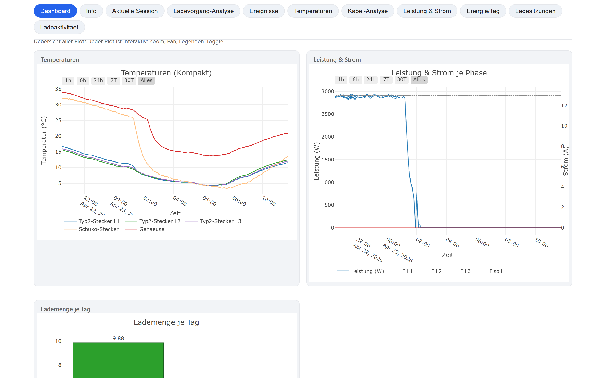

## Haftungsausschluss

Die Nutzung dieses Projekts erfolgt auf eigene Verantwortung. Ich uebernehme
keine Haftung fuer Schaeden, Fehlfunktionen, Datenverlust oder Folgeschaeden,
die durch Installation, Konfiguration oder Verwendung der Software entstehen.
Jede Person handelt eigenverantwortlich und sollte die Auswirkungen auf
Wallbox, Fahrzeug, Stromversorgung und lokale Umgebung selbst pruefen.

## Screenshots

<table>
<tr>
  <td width="50%">
    <b>Info-Tab</b> – Gerätedaten, Firmware, Netzwerk, DB-Statistik, Code-Nachschlagewerk
    <br><a href="docs/screenshots/02_info.png">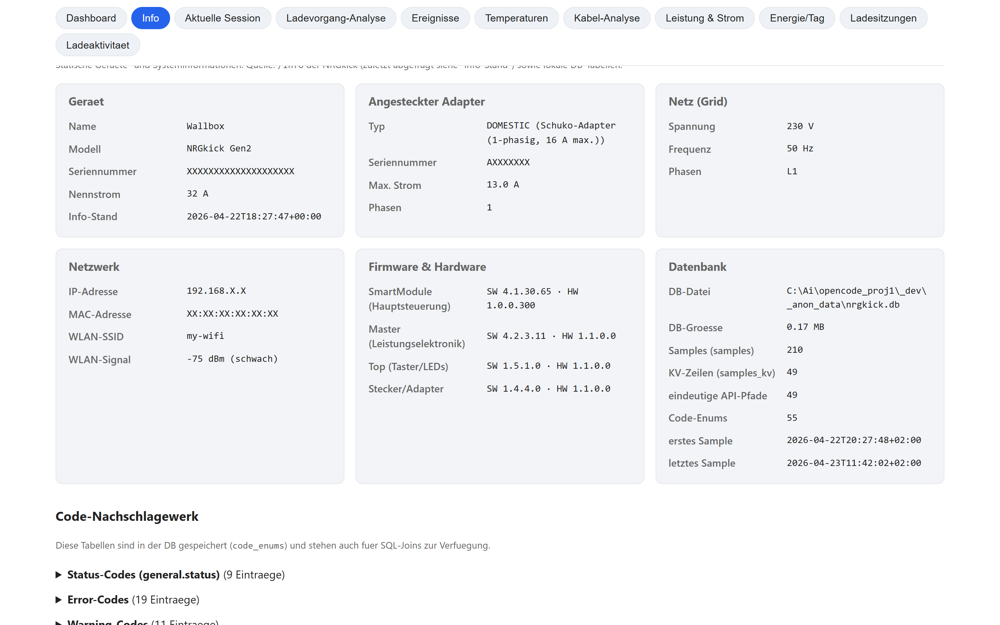</a>
  </td>
  <td width="50%">
    <b>Aktuelle Session</b> – Live-Fortschritt seit dem Einstecken
    <br><a href="docs/screenshots/03_current.png">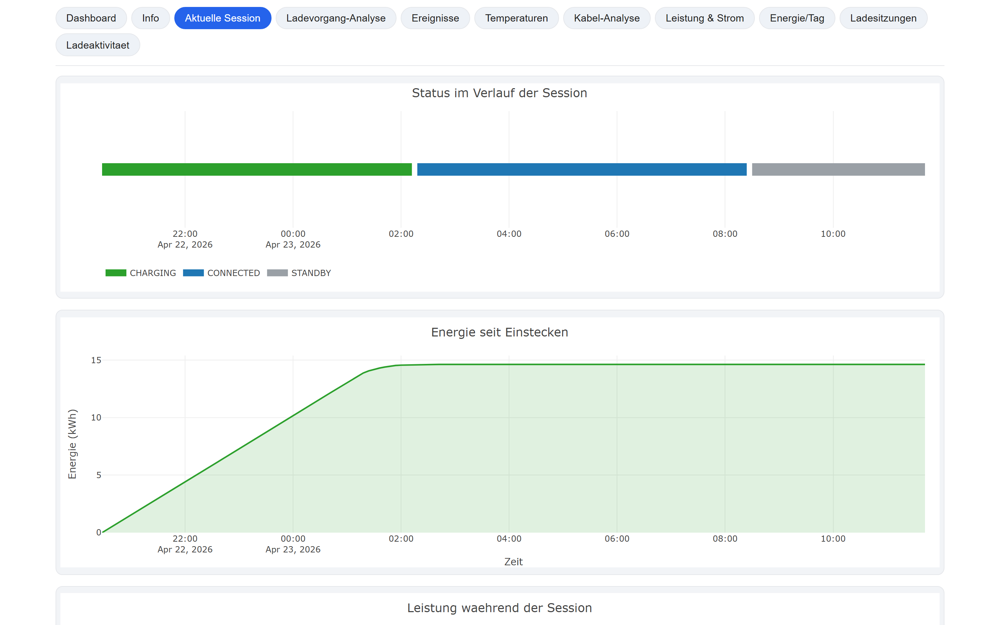</a>
  </td>
</tr>
<tr>
  <td width="50%">
    <b>Ladevorgang-Analyse</b> – Leistung/Temperatur/Strom auf einer Zeitachse mit Derating-Erkennung
    <br><a href="docs/screenshots/04_analysis.png">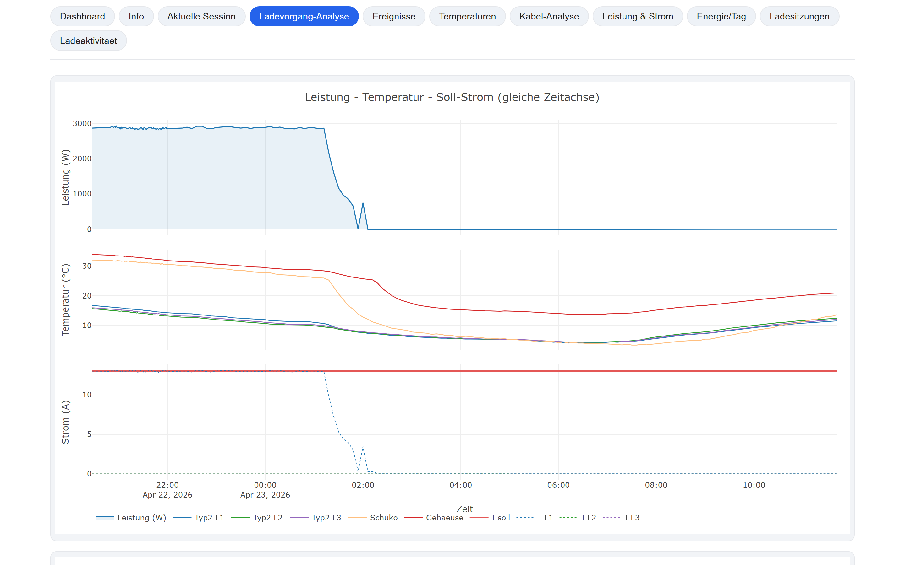</a>
  </td>
  <td width="50%">
    <b>Ereignisse</b> – Error- und Warning-Codes mit Klartext und Timeline
    <br><a href="docs/screenshots/05_events.png">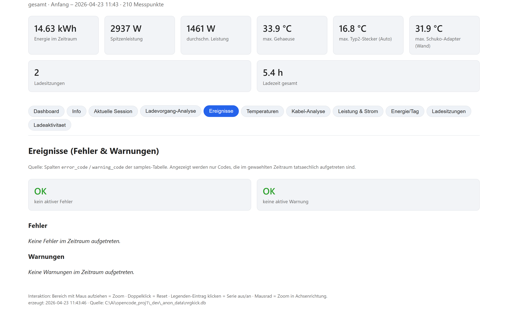</a>
  </td>
</tr>
<tr>
  <td width="50%">
    <b>Temperaturen</b> – Alle 6 Sensoren mit gruppierter Legende und Ampel-Kacheln
    <br><a href="docs/screenshots/06_temperatures.png">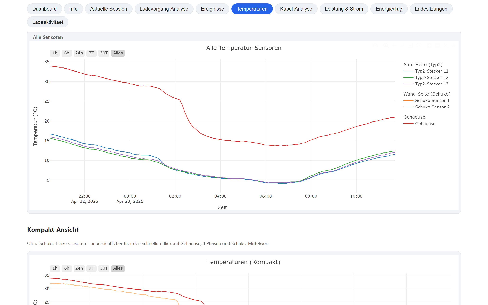</a>
  </td>
  <td width="50%">
    <b>Kabel-Analyse</b> – Strom vs. Temperatur mit Trendlinie und Empfehlung
    <br><a href="docs/screenshots/07_cable.png">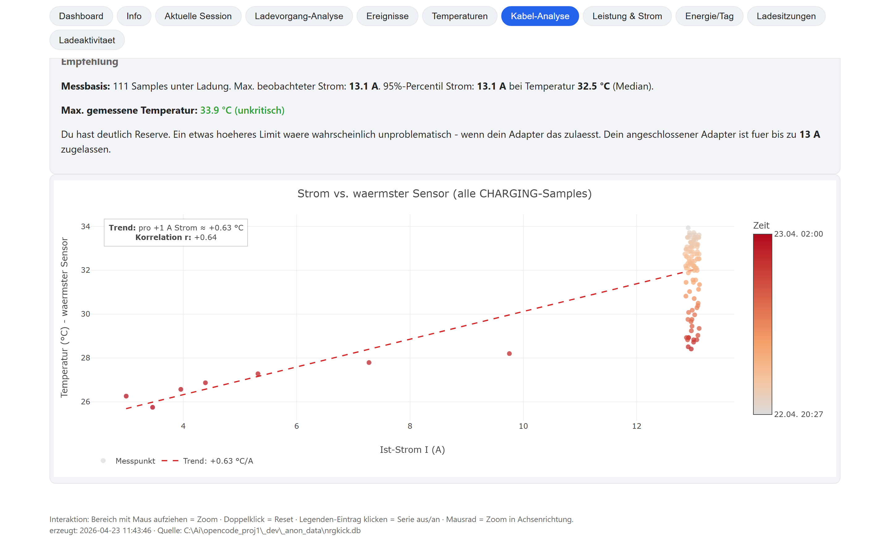</a>
  </td>
</tr>
<tr>
  <td width="50%">
    <b>Leistung & Strom</b> – Wirkleistung gesamt, Strom pro Phase, Soll-Strom
    <br><a href="docs/screenshots/08_power.png">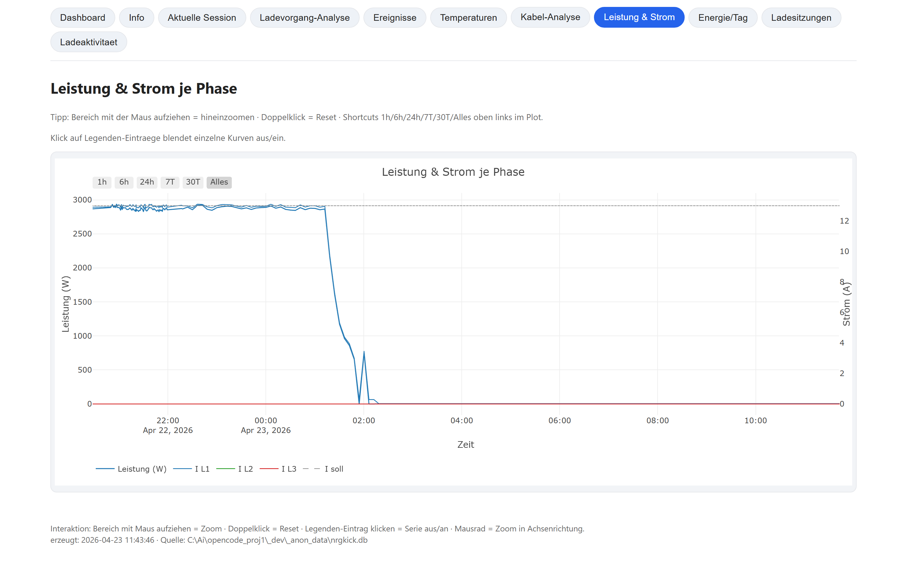</a>
  </td>
  <td width="50%">
    <b>Energie/Tag</b> – Lademenge je Tag in kWh
    <br><a href="docs/screenshots/09_energy.png">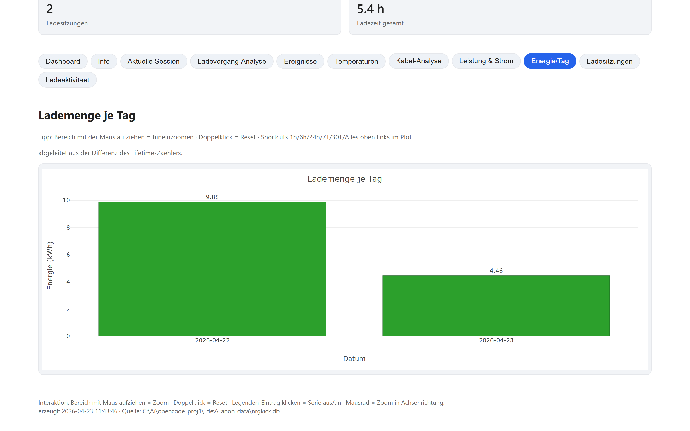</a>
  </td>
</tr>
<tr>
  <td width="50%">
    <b>Ladesitzungen</b> – Tabelle aller erkannten Ladevorgänge
    <br><a href="docs/screenshots/10_sessions.png">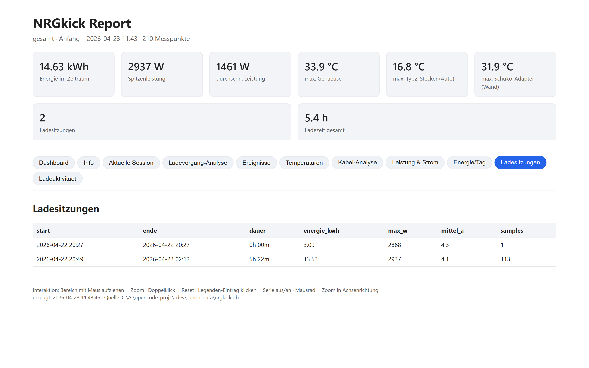</a>
  </td>
  <td width="50%">
    <b>Ladeaktivität</b> – Heatmap Tag × Stunde
    <br><a href="docs/screenshots/11_heatmap.png">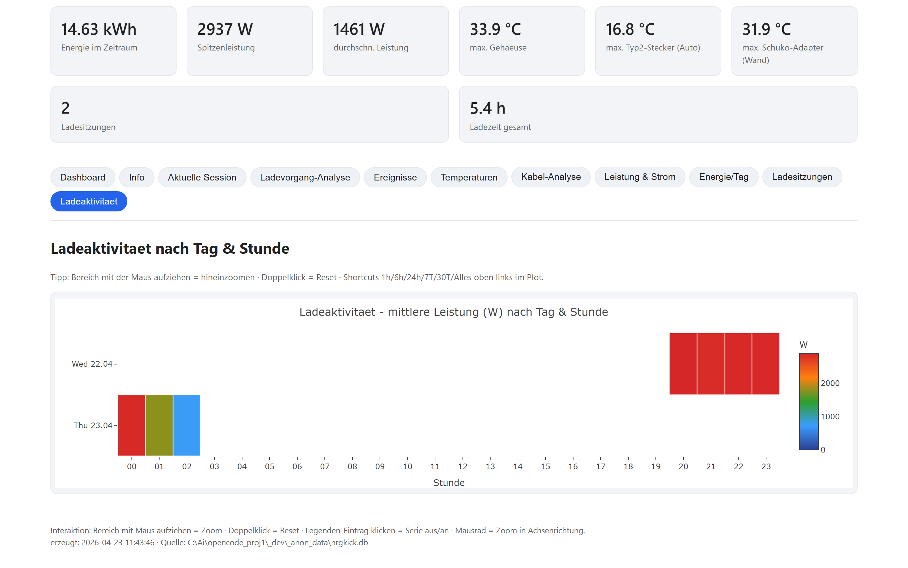</a>
  </td>
</tr>
</table>


## Was ist drin?

- **`nrgkick_logger.py`** — der Logger, pollt `/info`, `/values`, `/control`
  alle 6 Minuten (konfigurierbar). Schreibt in SQLite-Tabellen
  `samples`, `samples_kv`, `device_info`, `code_enums`.
- **`nrgkick_stats.py`** — erzeugt einen **interaktiven HTML-Report** mit
  allen Plots (Plotly) und 11 Tabs: Dashboard, Info, Aktuelle Session,
  Ladevorgang-Analyse, Ereignisse, Temperaturen, Kabel-Analyse, Leistung,
  Energie/Tag, Ladesitzungen, Ladeaktivität.
- **`nrgkick_config.py`** — zentrale Konfiguration (alle Defaults + Laden
  aus `config.json`, Deep-Merge, Pfad-Templates).
- **`service.ps1`** — Control-Script für den Windows-Dienst (NSSM-basiert).
- **`install_service.bat`, `uninstall_service.bat`, `service_restart.bat`,
  `service_status.bat`, `stats.bat`** — Doppelklick-Wrapper; `stats.bat`
  erzeugt direkt den HTML-Report.

## Voraussetzungen

- **Windows 10/11** (Linux wäre mit ein paar Anpassungen möglich - PRs willkommen)
- **Python 3.10+** im PATH
- **NRGkick Gen2** mit aktivierter Lokaler JSON-API (Firmware ≥ 4.0.0.64)
  - In der NRGkick-App: *Einstellungen → Lokale API → JSON API aktivieren*
  - Optional: Authentifizierung aktivieren (Benutzer/Passwort vergeben)
- Wallbox muss feste IP im LAN haben oder über mDNS erreichbar sein

## Installation

```powershell
# 1. Repository clonen
git clone https://github.com/<du>/nrgkick-logger.git
cd nrgkick-logger

# 2. Virtuelle Umgebung + Abhängigkeiten
python -m venv .venv
.\.venv\Scripts\python.exe -m pip install --upgrade pip
.\.venv\Scripts\python.exe -m pip install -r requirements.txt

# 3. Einmal manuell starten -> legt config.json mit Defaults an
.\.venv\Scripts\python.exe nrgkick_logger.py
#    -> Script meldet "Config unvollstaendig: bitte connection.host setzen"
```

Jetzt `%LOCALAPPDATA%\NRGkickLogger\config.json` öffnen und mindestens
`connection.host` auf die IP deiner NRGkick setzen. Dann:

```powershell
# Als Doppelklick: install_service.bat   (UAC bestätigen)
# ODER als Admin-PowerShell:
powershell -ExecutionPolicy Bypass -File .\service.ps1 install
```

Fertig. Der Dienst läuft im Hintergrund, Autostart nach Windows-Neustart,
Auto-Restart bei Crash. NSSM wird beim ersten `install` automatisch
heruntergeladen (~300 KB), du musst nichts manuell besorgen.

## Konfiguration

Alle Einstellungen in **einer** `config.json` unter
`%LOCALAPPDATA%\NRGkickLogger\config.json`. Eine vollständige
Beispielkonfiguration mit Erklärungen findest du in
[`config.example.json`](config.example.json).

### Wichtigste Einstellungen

| Pfad | Default | Bedeutung |
| --- | --- | --- |
| `connection.host` | `192.168.1.100` | **IP deiner NRGkick** (zwingend anpassen) |
| `connection.username` / `password` | `""` | nur wenn Auth in App aktiviert |
| `polling.interval_seconds` | `360` | Abfrage-Intervall (6 Min) |
| `data.data_dir` | `${LOCALAPPDATA}/${APPNAME}` | wohin Daten/Logs/DB |
| `thresholds.standby_power_w` | `50.0` | unter diesem Wert: kein Laden |
| `thresholds.temperature_warm/hot` | `60 / 75` | Schwellwerte für Ampel |
| `derating.min_delta_a` | `1.0` | Schwellwert-Stromänderung für Event-Erkennung |
| `report.default_range` | `24h` | Zeitraum beim Stats-Aufruf |
| `report.auto_open` | `true` | Browser nach Report-Erstellung öffnen |
| `ui.heatmap_colorscale` | blau→grün→rot | Farbskala für Heatmap |
| `service.service_name` | `NRGkickLogger` | Name des Windows-Dienstes |

### Mehrere Wallboxen parallel betreiben

Config mit anderem `service.service_name` erstellen und per `-ConfigFile`
übergeben:

```powershell
powershell -File .\service.ps1 install -ConfigFile C:\path\to\wallbox2.json
```

Das Stats-Tool ebenso:

```powershell
python nrgkick_stats.py --config C:\path\to\wallbox2.json
```

### Pfad-Templates

`data.data_dir` unterstützt die Platzhalter:

- `${LOCALAPPDATA}` → `C:\Users\<user>\AppData\Local`
- `${HOME}` → Home-Verzeichnis
- `${APPNAME}` → `NRGkickLogger`

Beispiel für einen NAS-Pfad: `"data_dir": "N:/wallbox/${APPNAME}"`.

## Dienst-Steuerung

```powershell
# ohne Admin-Rechte:
powershell -ExecutionPolicy Bypass -File .\service.ps1 status
powershell -ExecutionPolicy Bypass -File .\service.ps1 logs       # live-tail

# mit Admin (Script stuft sich selbst per UAC hoch falls noetig):
powershell -ExecutionPolicy Bypass -File .\service.ps1 install
powershell -ExecutionPolicy Bypass -File .\service.ps1 start
powershell -ExecutionPolicy Bypass -File .\service.ps1 stop
powershell -ExecutionPolicy Bypass -File .\service.ps1 restart
powershell -ExecutionPolicy Bypass -File .\service.ps1 uninstall
```

Oder bequem per **Doppelklick** auf eine der `*.bat`-Dateien.

## HTML-Report erzeugen

```powershell
# Default: alle Daten, alle Tabs, Browser öffnet automatisch
.\.venv\Scripts\python.exe nrgkick_stats.py

# Sieben Tage, Default-Tab "Aktuelle Session"
.\.venv\Scripts\python.exe nrgkick_stats.py --range 7d --default current

# Alles in der DB, ohne Browser
.\.venv\Scripts\python.exe nrgkick_stats.py --range all --no-open
```

Reports landen in `%LOCALAPPDATA%\NRGkickLogger\reports\` als einzelne
HTML-Dateien (mit Zeitstempel) plus stets eine `latest.html`.

Per Doppelklick auf `stats.bat` wird der Default-Report ebenfalls erzeugt;
die Batch-Datei legt bei Bedarf auch automatisch die `.venv` an und
installiert die Abhaengigkeiten.

### Tabs im Report

- **Dashboard** — Übersicht + Teaser zur aktuellen Session
- **Info** — Gerätedaten, Adapter, Netzwerk, Firmware, DB-Statistiken, Code-Nachschlagewerk
- **Aktuelle Session** — Live-Fortschritt seit letztem Einstecken (KPIs, Status-Band, Energie/Leistung/Strom, Energy-Limit-Balken)
- **Ladevorgang-Analyse** — Pro Session: Leistung/Temperatur/Strom auf gemeinsamer Zeitachse, Derating-Events, Scatter, Histogramm
- **Ereignisse** — alle Error-/Warning-Codes mit Klartext, Timeline
- **Temperaturen** — alle 6 Sensoren mit gruppierter Legende, Ampel-Kacheln
- **Kabel-Analyse** — Strom vs. Temperatur mit Trendlinie + Empfehlungstext
- **Leistung & Strom** — Wirkleistung + Strom pro Phase
- **Energie/Tag** — kWh je Tag als Balken
- **Ladesitzungen** — Tabelle aller erkannten Ladevorgänge
- **Ladeaktivität** — Heatmap Tag × Stunde

## Datenbank-Schema

- **`samples`** — ein Eintrag pro Messpunkt, mit Komfort-Spalten für schnelle Plots
- **`samples_kv`** — _alle_ API-Felder als Key-Value-Paare (zukunftssicher - neue Firmware-Felder werden automatisch mit-gespeichert)
- **`device_info`** — Gerätedaten aus `/info` (nur bei Änderung)
- **`code_enums`** — Klartext-Beschreibungen der NRGkick-Codes (error, warning, status, relay, rcd, connector_type)

### SQL-Beispiele

```sql
-- alle API-Felder auflisten
SELECT DISTINCT source, path FROM samples_kv ORDER BY source, path;

-- Zeitreihe eines beliebigen Felds
SELECT ts_utc, value_num FROM samples_kv
WHERE path = 'powerflow.peak_power' AND source = 'values'
ORDER BY ts_utc;

-- Fehler mit Klartext
SELECT kv.ts_utc, kv.value_text AS code, e.description, e.severity
FROM samples_kv kv
LEFT JOIN code_enums e ON e.kind = 'error' AND e.code = kv.value_text
WHERE kv.path = 'general.error_code' AND kv.value_text <> 'NO_ERROR';
```

## Troubleshooting

- **"Config unvollstaendig"** → `connection.host` in `config.json` setzen.
- **`NRGkick antwortete: API must be enabled within the NRGkick App`**
  → Lokale API in der App aktivieren.
- **401/403** → Benutzer/Passwort in Config und App müssen übereinstimmen.
- **Timeouts** → Ping-Test: `Test-NetConnection <ip> -Port 80`. Wallbox im selben VLAN?
- **Dienst schreibt in `system32`-Pfad** → In `config.json` `data.data_dir` auf absoluten User-Pfad setzen, oder Dienst unter eigenem User-Account laufen lassen.
- **Stats-Tool findet keine DB** → `--config <pfad>` nutzen oder `NRGKICK_CONFIG=<pfad>` setzen.

## Lizenz

MIT - siehe [LICENSE](LICENSE).

## Credits

Inspiriert von `andijakl/nrgkick-api` und der evcc-Community-Diskussion zur
lokalen JSON-API der NRGkick Gen2.
